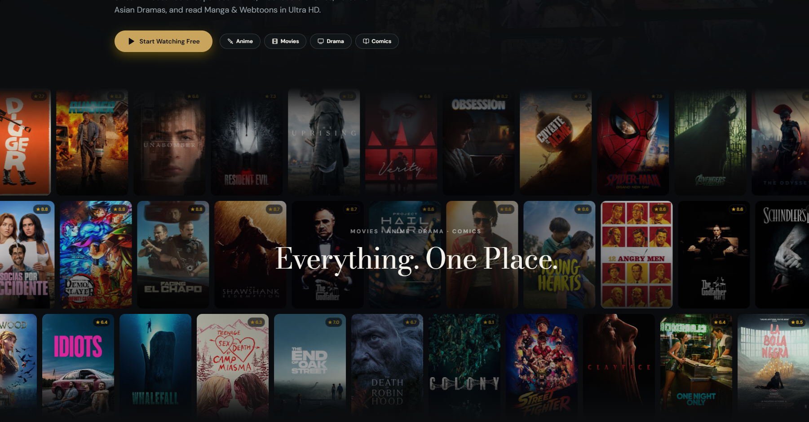
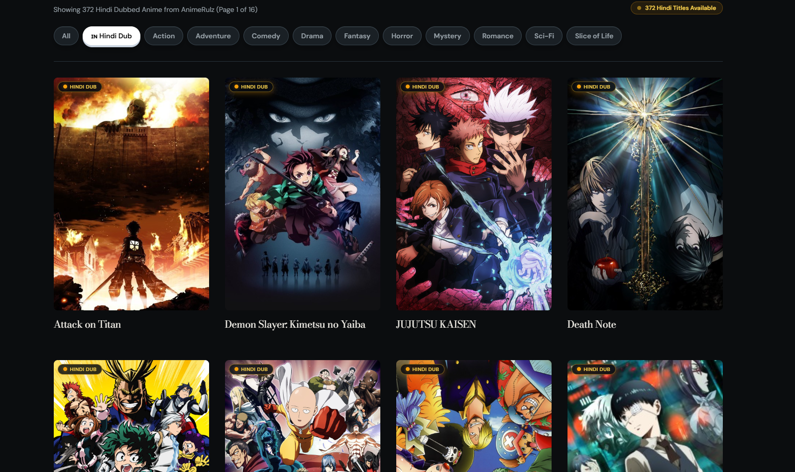
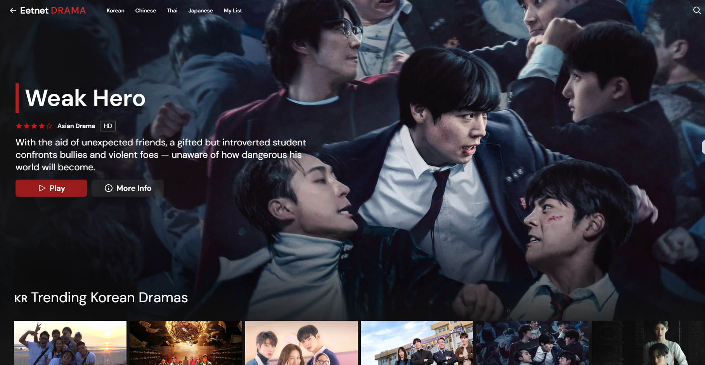
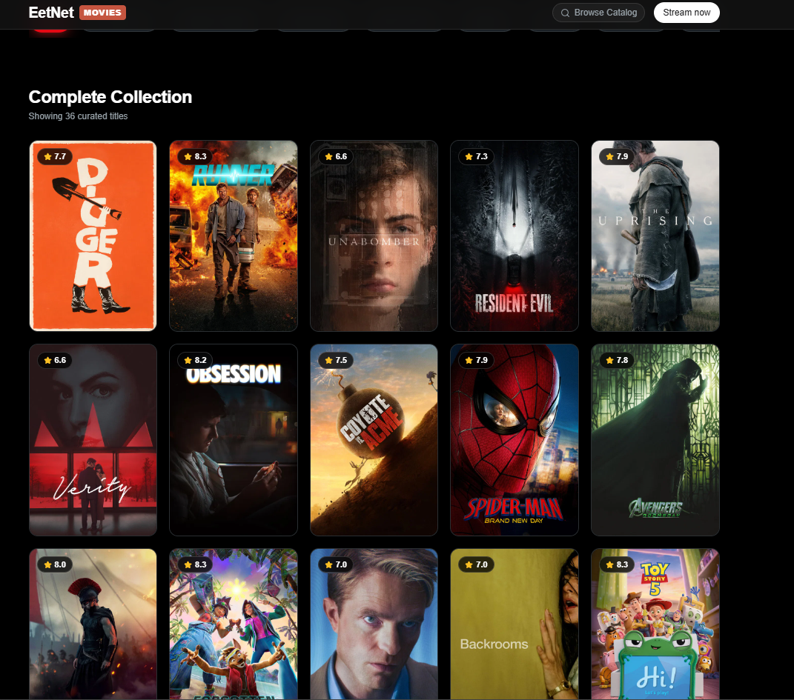

# Entertainment Aggregator (Archive)

> **Status: Discontinued / Archived**  
> This repository is a code archive of a personal full-stack project I built and have since discontinued. It is preserved here as a portfolio project. No media files are hosted here.  
>  
> 🔗 **Live Frontend Preview**: [https://eetnet.ooguy.com](https://eetnet.ooguy.com)  
> *(The frontend UI, animations, and components can be browsed live at the link above, though video streams and backend scrapers are decommissioned).*

---

## Overview

A unified full-stack media aggregator web application designed to bring together Anime, Asian Dramas, Comics/Manga, and Movies into a single clean, ad-free, Netflix-style interface.



---

## Content Sections & Sources

### 1. Anime (Subbed & Regional Dubs)
Aggregated from AnimeRulz, AnimedubHindi, Animedekho, Animesalt, and Animeworld India—featuring a curated catalog of 477 Hindi-dubbed anime series mapped to canonical AniList IDs.



### 2. Asian Dramas (K-Drama / C-Drama)
Aggregated from KissKH, featuring Korean, Chinese, and Japanese dramas with multi-language subtitle tracks.



### 3. Comics, Manga & Webtoons
Aggregated from ComicK, AsuraToon, TempleScan, and HiveToon with an interactive vertical webtoon/manga reader.

### 4. Movies & Cinema
Aggregated from NetMirror, DesiCinemas, and MoviePlex with official TMDB metadata integration.



---

## Key Features

- **Ad-Free Custom Video Player**: Custom HLS.js player with episode navigation, subtitle tracks, and quality switching—no third-party popups or redirects.
- **Unified Catalog Search**: Instant search and browsing across all 4 entertainment categories.
- **Smart HLS & Asset Proxying**: Backend proxies for M3U8 playlists, TS video segments, and comic pages to resolve cross-origin (CORS) and referer restrictions.
- **Watch History & Sync**: Integrated with Supabase for user watchlist and watch progress tracking across devices.

---

## Tech Stack

| Layer | Technology |
|---|---|
| **Frontend** | React 19, Vite, Tailwind CSS, Zustand |
| **Video Streaming** | HLS.js |
| **Backend API** | Node.js, Express |
| **Scraping & Extraction** | Cheerio, Axios |
| **Metadata & Covers** | TMDB API, AniList GraphQL |
| **Authentication & DB** | Supabase |

---

## Repository Structure

```
├── docs/                   # Architecture and screenshots
│   └── screenshots/        # UI preview images
├── services/               # Backend microservices
│   ├── anime/              # Anime scrapers & stream resolvers
│   ├── comics/             # Manga & webtoon scrapers + image proxy
│   ├── drama/              # Asian drama API & subtitle converter
│   └── movies/             # Movie scrapers & stream extractors
├── src/                    # React + Vite frontend application
│   ├── components/         # Reusable UI components & custom video player
│   ├── features/           # Category views (anime, drama, manga, movies)
│   └── pages/              # Main route views & layouts
├── research/               # Technical notes and source API documentation
├── server.js               # Root API server aggregating all services
└── package.json
```

---


---

## ⚠️ Known Technical & Security Trade-offs (Read Before Replicating)

All code in this repository is shared openly under the MIT License for anyone who wants to study, fork, or adapt it. However, if you plan to run or replicate this architecture, be aware of the deliberate trade-offs made during development:

1. **Relaxed TLS Verification (`rejectUnauthorized: false`)**:
   - *Why it's there*: Several upstream mirrors and stream hosts use expired, self-signed, or misconfigured SSL certificates. Node.js rejects these requests by default unless strict verification is bypassed.
   - *Security note*: In a production environment, this exposes outgoing requests to Man-in-the-Middle (MITM) risks.

2. **Open Streaming Proxies (`/api/m3u8-proxy`, `/api/ts-proxy`)**:
   - *Why it's there*: Required to inject custom `Referer` headers and rewrite HLS playlist chunks on the fly so browser players don't hit CORS blocks.
   - *Security note*: The proxy currently forwards arbitrary query URLs without an allowlist. If deployed to a public cloud IP without authentication, it acts as an open proxy.

3. **Permissive CORS (`*`)**:
   - *Why it's there*: Configured for frictionless local development between the mobile/local backend and the Vite frontend.
   - *Security note*: A hardened production deployment should restrict `Access-Control-Allow-Origin` to specific frontend domains.

4. **Upstream Fragility**:
   - Third-party streaming sources frequently change their DOM structures, rotate domain mirrors, and update tokens. Scrapers require ongoing maintenance to stay functional.


---

## License & Disclaimer

- **License**: This project is open-source under the [MIT License](LICENSE)—completely free to use, modify, fork, or replicate.
- **Disclaimer**: The software is provided "as is", without warranty of any kind. No media files or copyrighted streams are hosted on this repository. The project is permanently discontinued and no longer maintained.
